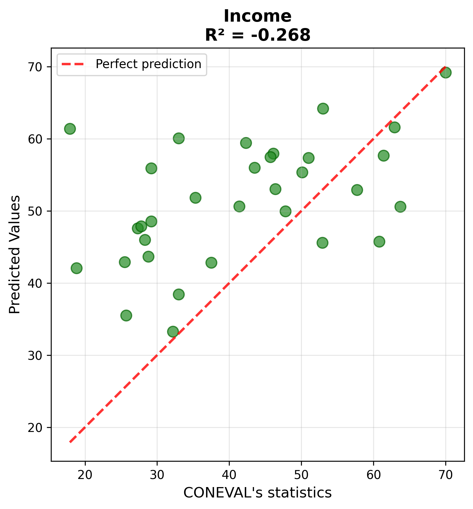
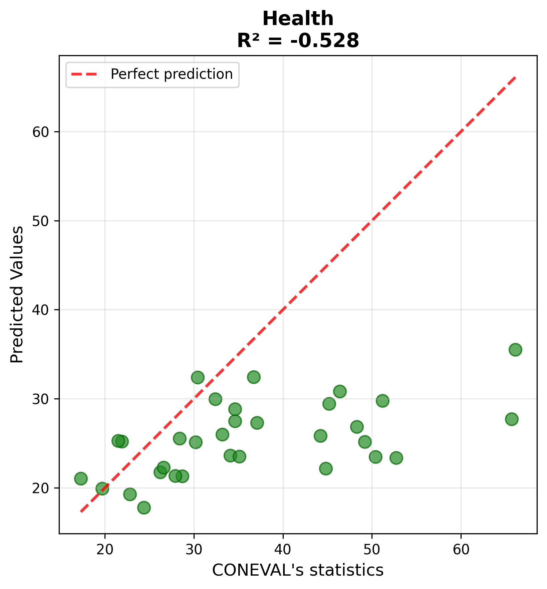
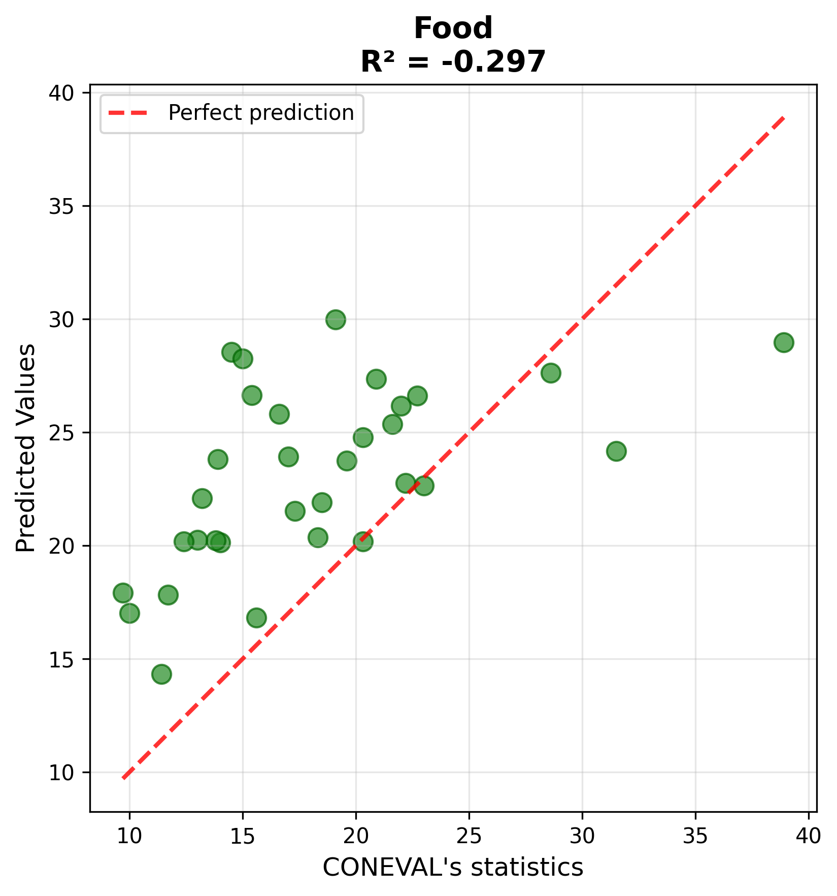
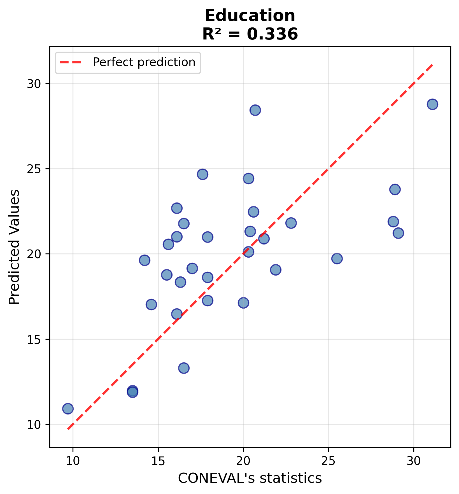
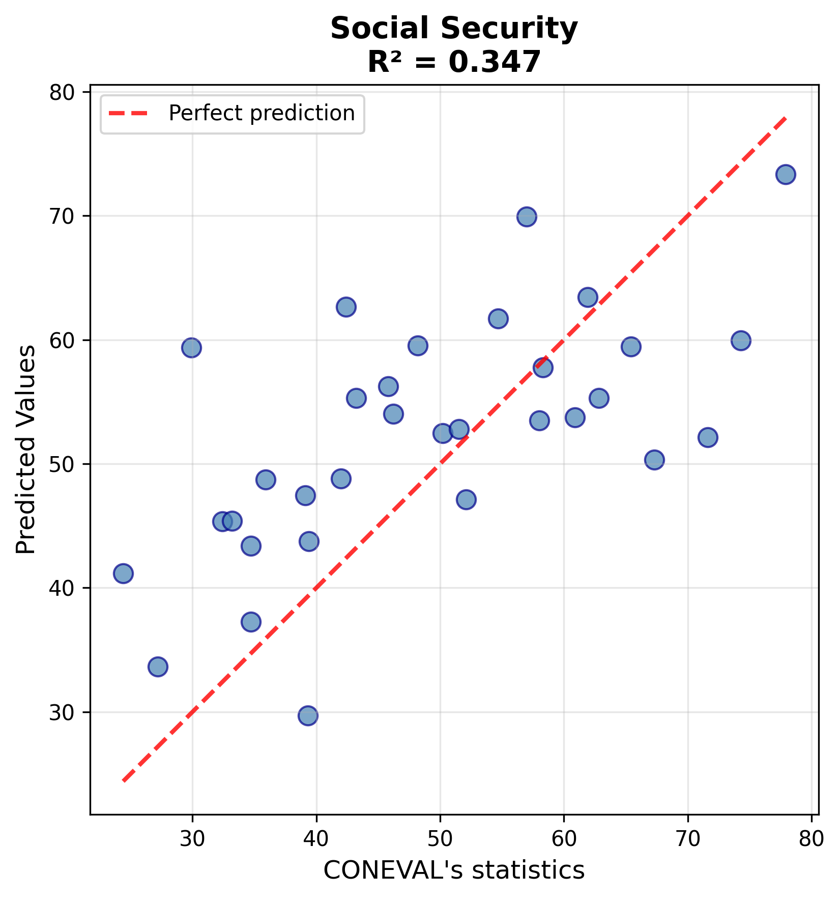
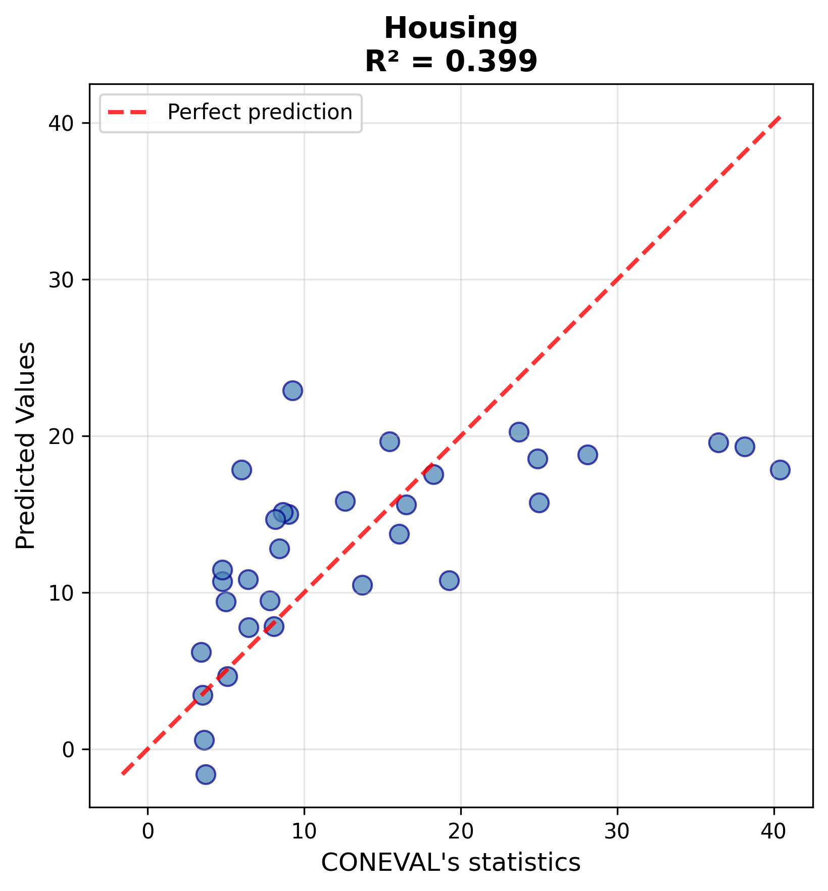

# Real-Time Multidimensional Poverty Nowcasting in Mexico

## Overview  
This project develops a data-driven tool for real-time detection and quantification of **multidimensional poverty** across all 32 Mexican states. By leveraging text-rich data from social media platforms and news outlets, the tool bridges the gap between **outdated official statistics** and **real-time needs**, enabling more timely and targeted social interventions.

This work is part of a thesis project aimed at creating a robust framework for nowcasting poverty across its multiple dimensions. The urgency of this task is particularly high in the Mexican context, where persistent structural problems — including poverty, inequality, and lack of state presence — provide fertile ground for the expansion of criminal organizations.

---

## 🎯 Motivation  
Traditional poverty estimation methods rely on **infrequent surveys** and often **outdated data**. Mexico’s latest official multidimensional poverty statistics date back to **2022**, creating a lag in capturing current socioeconomic dynamics.

This project responds to the need for:
- Real-time insights into poverty dynamics  
- Early-warning systems for deteriorating conditions  
- Enhanced intervention targeting based on current conditions  

---

## 🗂 Repository Structure  

---

## 🌐 Data Collection  

We use four heterogeneous sources to capture different forms of textual expression and public discourse:

### 1. **Telegram**  
- Scraped using [`telethon`](https://github.com/LonamiWebs/Telethon)  
- Political and economic Mexican channels (e.g., *El Universal*, *Sin Embargo MX*)  
- Messages are classified by State and stored in MongoDB  
- Posts are categorized into poverty dimensions using Spanish keyword embeddings  

### 2. **YouTube**  
- Scraped using the official Google API  
- For each state: `state + noticias/economía/news`  
- 300 videos per state and up to 300 comments per video  
- No MongoDB storage: comments are processed after scraping  
- Comments classified by dimension using multilingual embeddings  

### 3. **News Outlets**  
- Data from **Google News** and **MediaCloud**  
- Filtered by articles mentioning each Mexican state  
- Decoded redirected URLs and scraped full text using `trafilatura`  
- News processed via LDA to extract topics per state/year  

### 4. **Google Trends**  
- Accessed via **SerpApi**  
- Queried using 3–4 keywords per poverty dimension  
- We aggregate interest over time per dimension and state  

---

## 🧪 Data Processing  

Each source required tailored NLP approaches due to the diversity in formality, language, and depth:

### Word Embedding Classification  
Used to assign YouTube comments and Telegram posts to poverty dimensions.

- **YouTube**:  
  `paraphrase-multilingual-MiniLM-L12-v2` – multilingual, informal/jargon-rich  
- **Telegram**:  
  `hiiamsid/sentence_similarity_spanish_es` – formal, Spanish-optimized  

### Sentiment Analysis (YouTube Only)  
- Model: `nlptown/bert-base-multilingual-uncased-sentiment`  
- Original scores [0–5] normalized to [-1, 1]  
- Not applied to Telegram, as posts are factual/news-like  

### LDA Topic Modeling (News)  
- 8 topics fitted per state/year  
- Reduced topic overlap via `eta` and `alpha` tuning  
- LDA output: topic share vector per state  

---

## 🧩 Components Retrieved  

From the above analysis, we extract the following components:

- **YouTube Conditional Sentiment Score**: average sentiment per dimension and state  
- **YouTube Dimension Share**: percentage of comments discussing each dimension  
- **Telegram Dimension Share**: percentage of posts discussing each dimension  
- **LDA Topic Shares**: state-level topic distribution from news  
- **Google Trends Interest**: average interest per poverty dimension  

---

## 📈 PLS Regression for Nowcasting  

To estimate current poverty levels, we use **Partial Least Squares Regression (PLS)** on the above components.

- The model is trained using available ground truth (2020 and 2022 official data)  
- Weights from PLS are used to nowcast poverty for the latest year  
- Two approaches are tested:
  1. Training on 2020 only → testing on 2022  
  2. Training on 2020 + 2022 → validating on 2022  

---

## Results

### 🔢 Mean Absolute Error (MAE) by Dimension

| Dimension         | MAE       |
|------------------|-----------|
| income           | 12.77     |
| health           | 11.76     |
| food             | 6.04      |
| education        | 3.32      |
| social_security  | 9.50      |
| housing          | 6.09      |
| **Average**      | **8.25**  |

> Note: `r²` values and features used per dimension are available in `metrics.csv`

### 📈 Visual Results

#### ❌ Worst Performing Dimensions

The following dimensions showed the **poorest predictive performance**. This is likely due to the fact that they are **highly sensitive to short-term economic and health shocks**, such as those caused by the COVID-19 pandemic. Since the model was trained on data from 2020 (a year deeply impacted by the pandemic) and validated on 2022 (a partial recovery period), the underlying conditions for these dimensions changed significantly between training and prediction periods.

- **Income**: Subject to large fluctuations due to lockdowns, informal work disruption, and government aid  
- **Health**: Severely impacted by pandemic-related strain on the healthcare system  
- **Food**: Affected by supply chain interruptions and inflation in basic goods  

  
  
  

#### ✅ Best Performing Dimensions

These dimensions achieved **better prediction accuracy**, as they reflect more **structural and slowly-evolving aspects** of multidimensional poverty. Unlike income or health, they are less influenced by short-term shocks like the COVID-19 crisis, and thus the model generalizes more robustly across years.

- **Education**: Although affected by school closures, structural gaps remain stable over time  
- **Social Security**: Mostly tied to institutional access, which evolves gradually  
- **Housing**: Based on physical conditions or infrastructure, typically slow-changing  

  
  

